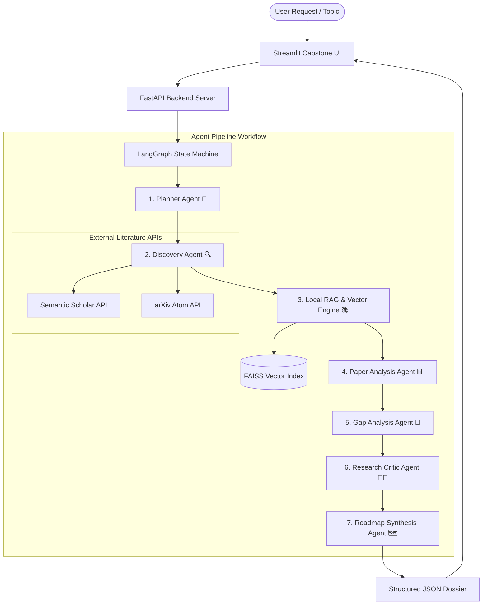

# 🎓 ReSearchAI: Autonomous AI Research Mentor & Roadmap Synthesizer

> **Atomcamp Agentic AI Bootcamp — Final Capstone Project**  
> An autonomous multi-agent platform powered by **LangGraph**, **Groq LLMs**, **FAISS RAG**, **Semantic Scholar**, **arXiv**, and **Streamlit**.

---

## 🌟 Overview & Problem Statement

Students and early-stage researchers often struggle to transition from a broad research topic to a well-formulated, novel research direction. Existing tools either dump hundreds of paper links without synthesis or generate hallucinated research ideas unsupported by scientific literature.

**ReSearchAI** solves this by orchestrating **7 specialized AI agents**:
1. **Planner Agent**: Structures the initial research scope, subtopics, and questions.
2. **Discovery Agent**: Automatically queries academic databases (**Semantic Scholar** & **arXiv**) and deduplicates paper literature.
3. **Local Vector RAG Engine**: Chunks paper abstracts/full-texts, generates local embeddings (`all-MiniLM-L6-v2`), and indexes them in a **FAISS** vector store.
4. **Paper Analysis Agent**: Extracts factual methodologies, datasets, findings, and limitations strictly grounded in retrieved RAG evidence.
5. **Gap Analysis Agent**: Performs cross-paper meta-analysis to discover unaddressed research gaps across literature.
6. **Research Critic Agent**: Acts as a skeptical peer reviewer, rigorously evaluating evidence strength and potential flaws in proposed gaps.
7. **Roadmap Synthesis Agent**: Converts validated research gaps into a practical, step-by-step 4–8 week execution plan for students.

---

## 🏗️ Multi-Agent System Architecture



---

## 📝 Agent Prompt Design & Engineering

Each agent in the pipeline uses strict prompt engineering strategies to eliminate hallucinations and enforce scientific rigor:

| Agent | Prompt Design Strategy | Primary Output Schema |
| :--- | :--- | :--- |
| **Planner Agent** | System persona as an academic research director. Forces pure JSON output detailing title, subtopics, research questions, and methodology. | `PlannerOutput` |
| **Paper Analysis (RAG)** | Enforces strict **In-Context Grounding Rules**. Mandates `"Not specified in available evidence"` for missing data; forbids external background hallucination. | `PaperAnalysis` |
| **Gap Analysis Agent** | Requires cross-paper meta-comparison. Enforces cautious scientific claims (e.g. *"In this sample..."*) and categorizes gaps (Dataset, Methodology, Evaluation). | `ResearchGap` |
| **Research Critic Agent** | Skeptical reviewer persona. Instructed **not** to accept gaps automatically; assigns verdicts (*Supported*, *Partially Supported*, *Weak*) and explicit concerns. | `CriticResult` |
| **Roadmap Synthesis Agent** | Translates evaluated gaps into actionable student milestones: direction, objectives, timeline, step-by-step implementation, metrics, and risks. | `RoadmapResult` |

---

## 🛠️ Technology Stack

- **Orchestration**: LangGraph, LangChain
- **LLM Inference**: Groq API (`qwen/qwen3.8-27b` / `llama3-70b-8192`)
- **Embeddings & Vector Store**: `sentence-transformers` (`all-MiniLM-L6-v2`), `faiss-cpu`
- **External APIs**: Semantic Scholar Academic Graph API, arXiv Atom Query API
- **Backend API**: FastAPI, Uvicorn, Pydantic v2
- **Frontend Dashboard**: Streamlit (with Custom Theme & Multi-Agent Status Visualizer)
- **Testing & Quality**: Pytest (56 Unit & Integration Tests)
- **DevOps**: Docker, Docker Compose

---

## 🚀 Installation & Local Setup

### 1. Clone & Environment Setup

```bash
git clone https://github.com/your-username/ReSearchAI.git
cd ReSearchAI

# Create virtual environment
python -m venv venv
# On Windows:
venv\Scripts\activate
# On macOS/Linux:
source venv/bin/activate

# Install dependencies
pip install -r requirements.txt
```

### 2. Configure Environment Variables

Create a `.env` file in the root directory:

```env
GROQ_API_KEY=your_groq_api_key_here
GROQ_MODEL=qwen/qwen3.8-27b
SEMANTIC_SCHOLAR_API_KEY=optional_semantic_scholar_key
```

### 3. Run Application

**Terminal 1 — FastAPI Backend:**
```bash
python -m uvicorn backend.main:app --host 127.0.0.1 --port 8000
```

**Terminal 2 — Streamlit Frontend:**
```bash
python -m streamlit run frontend/app.py --server.port 8501
```

Access the Streamlit Dashboard at [**http://localhost:8501**](http://localhost:8501).

---

## 🐳 Docker Deployment

Run the entire application stack using Docker Compose:

```bash
docker-compose up --build
```

- **Backend API**: `http://localhost:8000`
- **Frontend UI**: `http://localhost:8501`

---

## 🧪 Automated Testing

ReSearchAI includes a comprehensive test suite (56 tests) covering Pydantic schemas, agent node execution, RAG vector retrieval, and backend endpoints.

```bash
python -m pytest
```

---

## 📜 Submission Deliverables Checklist

- [x] **Clean Codebase & Repo**: Structured FastAPI backend, LangGraph state graph, Streamlit UI.
- [x] **56 Unit & Integration Tests Passing**: Run `python -m pytest`.
- [x] **Docker Containerization**: `Dockerfile` & `docker-compose.yml` operational.
- [x] **Detailed README**: Setup, architecture diagram (Mermaid), agent prompt design, and execution guide.
- [ ] **Demo Video (2–5 mins)**: *(To be recorded by student showing problem, live demo & architecture)*.
- [ ] **Live App URL / Docker Link**: Submitted via atomcamp portal.
